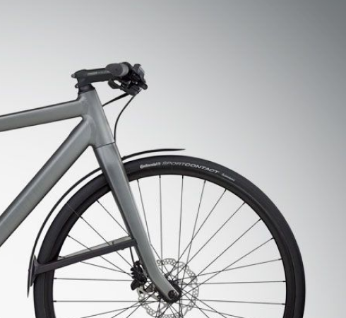
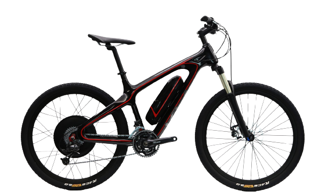
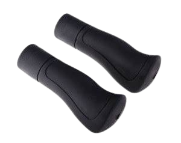
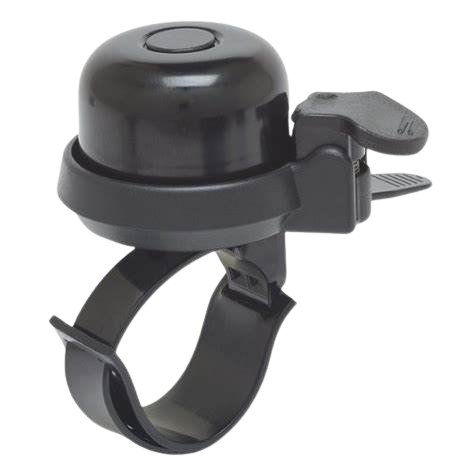
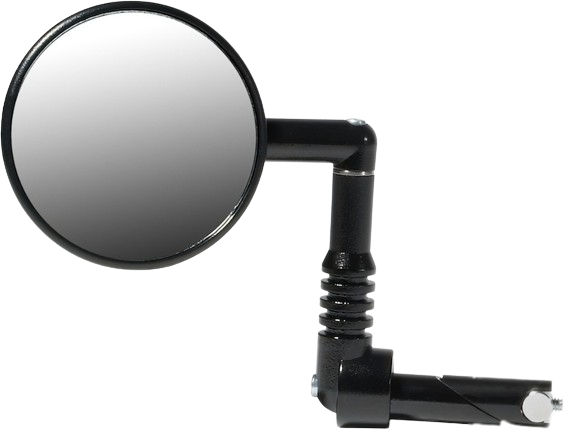
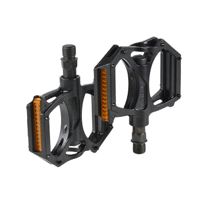
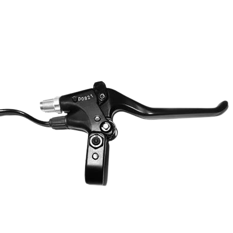
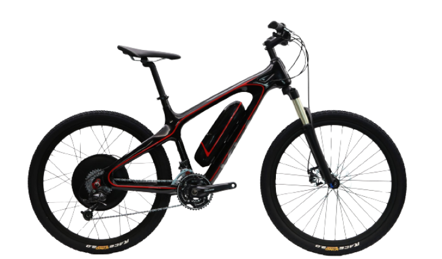

<!DOCTYPE html>
<html lang="en">
<head>
    <meta charset="UTF-8">
    <meta name="viewport" content="width=device-width, initial-scale=1.0">
    <title>BIKYS</title>
    <link rel="stylesheet" href="css/style.css">
</head>
<body>
    <!--top-section-->
    

        

        

            <h1>BIKYS</h1>
        

    

        

            

                

                <svg xmlns="http://www.w3.org/2000/svg" width="12" height="15" viewBox="0 0 12 15" fill="none">
                    <path d="M6 0C2.69178 0 6.10828e-05 2.69175 6.10828e-05 5.99625C-0.0216887 10.83 5.772 14.838 6 15C6 15 12.0217 10.83 11.9999 6C11.9999 2.69175 9.30822 0 6 0ZM6 9C4.34252 9 3.00003 7.6575 3.00003 6C3.00003 4.3425 4.34252 3 6 3C7.65748 3 8.99997 4.3425 8.99997 6C8.99997 7.6575 7.65748 9 6 9Z" fill="white"/>
                  </svg>
                  <h4><a href="#">Find a Retailer</a></h4>
                  <h4><a href="#">Contact Us</a></h4>
                

                

                    <h4>USD</h4>
                    <a href="#"><svg xmlns="http://www.w3.org/2000/svg" width="8" height="5" viewBox="0 0 8 5" fill="none">
                        <path d="M7.77552 0.232761C7.63333 0.0836789 7.44099 0 7.2405 0C7.04001 0 6.84766 0.0836789 6.70547 0.232761L3.98103 3.06631L1.29453 0.232761C1.15234 0.0836789 0.959994 0 0.759504 0C0.559014 0 0.36667 0.0836789 0.224481 0.232761C0.15335 0.307172 0.0968926 0.395701 0.0583643 0.493242C0.0198361 0.590782 0 0.695404 0 0.801071C0 0.906738 0.0198361 1.01136 0.0583643 1.1089C0.0968926 1.20644 0.15335 1.29497 0.224481 1.36938L3.44221 4.76323C3.51276 4.83826 3.59669 4.8978 3.68917 4.93844C3.78165 4.97908 3.88084 5 3.98103 5C4.08121 5 4.1804 4.97908 4.27288 4.93844C4.36536 4.8978 4.4493 4.83826 4.51984 4.76323L7.77552 1.36938C7.84665 1.29497 7.90311 1.20644 7.94163 1.1089C7.98016 1.01136 8 0.906738 8 0.801071C8 0.695404 7.98016 0.590782 7.94163 0.493242C7.90311 0.395701 7.84665 0.307172 7.77552 0.232761Z" fill="white"/>
                      </svg></a>
                      <h4>ENG</h4>
                      <a href="#"><svg xmlns="http://www.w3.org/2000/svg" width="8" height="5" viewBox="0 0 8 5" fill="none">
                        <path d="M7.77552 0.232761C7.63333 0.0836789 7.44099 0 7.2405 0C7.04001 0 6.84766 0.0836789 6.70547 0.232761L3.98103 3.06631L1.29453 0.232761C1.15234 0.0836789 0.959994 0 0.759504 0C0.559014 0 0.36667 0.0836789 0.224481 0.232761C0.15335 0.307172 0.0968926 0.395701 0.0583643 0.493242C0.0198361 0.590782 0 0.695404 0 0.801071C0 0.906738 0.0198361 1.01136 0.0583643 1.1089C0.0968926 1.20644 0.15335 1.29497 0.224481 1.36938L3.44221 4.76323C3.51276 4.83826 3.59669 4.8978 3.68917 4.93844C3.78165 4.97908 3.88084 5 3.98103 5C4.08121 5 4.1804 4.97908 4.27288 4.93844C4.36536 4.8978 4.4493 4.83826 4.51984 4.76323L7.77552 1.36938C7.84665 1.29497 7.90311 1.20644 7.94163 1.1089C7.98016 1.01136 8 0.906738 8 0.801071C8 0.695404 7.98016 0.590782 7.94163 0.493242C7.90311 0.395701 7.84665 0.307172 7.77552 0.232761Z" fill="white"/>
                      </svg></a>
                  

            

            

                    <ul class="navigation">
                        <li><a href="#">Home</a>
                            <svg xmlns="http://www.w3.org/2000/svg" width="6" height="6" viewBox="0 0 6 6" fill="none">
                                <path d="M4.5 0H1.5C0.671573 0 0 0.671573 0 1.5V4.5C0 5.32843 0.671573 6 1.5 6H4.5C5.32843 6 6 5.32843 6 4.5V1.5C6 0.671573 5.32843 0 4.5 0Z" fill="#FEDC03"/>
                              </svg>
                        </li>
                        <li><a href="#">Shop</a>
                            <svg xmlns="http://www.w3.org/2000/svg" width="6" height="6" viewBox="0 0 6 6" fill="none">
                                <path d="M4.5 0H1.5C0.671573 0 0 0.671573 0 1.5V4.5C0 5.32843 0.671573 6 1.5 6H4.5C5.32843 6 6 5.32843 6 4.5V1.5C6 0.671573 5.32843 0 4.5 0Z" fill="#FEDC03"/>
                              </svg>
                        </li>
                        <li><a href="#">accessories</a>
                            <svg xmlns="http://www.w3.org/2000/svg" width="6" height="6" viewBox="0 0 6 6" fill="none">
                                <path d="M4.5 0H1.5C0.671573 0 0 0.671573 0 1.5V4.5C0 5.32843 0.671573 6 1.5 6H4.5C5.32843 6 6 5.32843 6 4.5V1.5C6 0.671573 5.32843 0 4.5 0Z" fill="#FEDC03"/>
                              </svg>
                        </li>
                        <li><a href="#">sale</a>
                            <svg xmlns="http://www.w3.org/2000/svg" width="6" height="6" viewBox="0 0 6 6" fill="none">
                                <path d="M4.5 0H1.5C0.671573 0 0 0.671573 0 1.5V4.5C0 5.32843 0.671573 6 1.5 6H4.5C5.32843 6 6 5.32843 6 4.5V1.5C6 0.671573 5.32843 0 4.5 0Z" fill="#FEDC03"/>
                              </svg>
                            </li>
                        <li><a href="#">Pages</a>
                            <svg xmlns="http://www.w3.org/2000/svg" width="6" height="6" viewBox="0 0 6 6" fill="none">
                                <path d="M4.5 0H1.5C0.671573 0 0 0.671573 0 1.5V4.5C0 5.32843 0.671573 6 1.5 6H4.5C5.32843 6 6 5.32843 6 4.5V1.5C6 0.671573 5.32843 0 4.5 0Z" fill="#FEDC03"/>
                              </svg>
                        </li>
                        <li><a href="#">blog</a>
                            <svg xmlns="http://www.w3.org/2000/svg" width="6" height="6" viewBox="0 0 6 6" fill="none">
                                <path d="M4.5 0H1.5C0.671573 0 0 0.671573 0 1.5V4.5C0 5.32843 0.671573 6 1.5 6H4.5C5.32843 6 6 5.32843 6 4.5V1.5C6 0.671573 5.32843 0 4.5 0Z" fill="#FEDC03"/>
                              </svg>
                        </li>
                    </ul>
                    

                          <input type="search" placeholder="Start your search here....">
                          <svg xmlns="http://www.w3.org/2000/svg" width="18" height="20" viewBox="0 0 18 20" fill="none">
                            <path d="M9 2.10526C8.58286 2.10526 8.1698 2.18694 7.78442 2.34564C7.39903 2.50434 7.04886 2.73695 6.7539 3.03019C6.45893 3.32343 6.22496 3.67155 6.06532 4.05468C5.90569 4.43782 5.82353 4.84846 5.82353 5.26316C5.82353 5.67786 5.90569 6.0885 6.06532 6.47163C6.22496 6.85477 6.45893 7.20289 6.7539 7.49613C7.04886 7.78936 7.39903 8.02197 7.78442 8.18067C8.1698 8.33937 8.58286 8.42105 9 8.42105C9.84245 8.42105 10.6504 8.08835 11.2461 7.49613C11.8418 6.90391 12.1765 6.10068 12.1765 5.26316C12.1765 4.42563 11.8418 3.62241 11.2461 3.03019C10.6504 2.43797 9.84245 2.10526 9 2.10526ZM3.70588 5.26316C3.70588 3.86728 4.26365 2.52858 5.25649 1.54154C6.24933 0.55451 7.59591 0 9 0C10.4041 0 11.7507 0.55451 12.7435 1.54154C13.7363 2.52858 14.2941 3.86728 14.2941 5.26316C14.2941 6.65903 13.7363 7.99774 12.7435 8.98477C11.7507 9.97181 10.4041 10.5263 9 10.5263C7.59591 10.5263 6.24933 9.97181 5.25649 8.98477C4.26365 7.99774 3.70588 6.65903 3.70588 5.26316ZM0 17.8947C0 16.4989 0.557772 15.1602 1.55061 14.1731C2.54345 13.1861 3.89003 12.6316 5.29412 12.6316H12.7059C13.4011 12.6316 14.0895 12.7677 14.7319 13.0322C15.3742 13.2967 15.9578 13.6844 16.4494 14.1731C16.941 14.6619 17.331 15.2421 17.597 15.8806C17.8631 16.5192 18 17.2036 18 17.8947V20H15.8824V17.8947C15.8824 17.0572 15.5477 16.254 14.952 15.6618C14.3563 15.0695 13.5483 14.7368 12.7059 14.7368H5.29412C4.45167 14.7368 3.64372 15.0695 3.04801 15.6618C2.45231 16.254 2.11765 17.0572 2.11765 17.8947V20H0V17.8947Z" fill="black"/>
                          </svg>
                          <svg xmlns="http://www.w3.org/2000/svg" width="22" height="19" viewBox="0 0 22 19" fill="none">
                            <path d="M15.9107 0C13.8826 0 12.1069 0.878957 11 2.36467C9.89312 0.878957 8.11741 0 6.08929 0C4.47487 0.00183387 2.92709 0.648983 1.78552 1.79947C0.643952 2.94996 0.00181965 4.50983 0 6.13686C0 13.0656 10.1937 18.6739 10.6278 18.9055C10.7422 18.9675 10.8701 19 11 19C11.1299 19 11.2578 18.9675 11.3722 18.9055C11.8063 18.6739 22 13.0656 22 6.13686C21.9982 4.50983 21.356 2.94996 20.2145 1.79947C19.0729 0.648983 17.5251 0.00183387 15.9107 0ZM11 17.302C9.20661 16.2488 1.57143 11.4512 1.57143 6.13686C1.57299 4.92977 2.04948 3.77257 2.8964 2.91903C3.74333 2.06549 4.89155 1.58528 6.08929 1.58371C7.99955 1.58371 9.60339 2.60916 10.2732 4.25621C10.3324 4.40145 10.4331 4.52567 10.5625 4.61309C10.6919 4.70051 10.8442 4.74719 11 4.74719C11.1558 4.74719 11.3081 4.70051 11.4375 4.61309C11.5669 4.52567 11.6676 4.40145 11.7268 4.25621C12.3966 2.60619 14.0004 1.58371 15.9107 1.58371C17.1084 1.58528 18.2567 2.06549 19.1036 2.91903C19.9505 3.77257 20.427 4.92977 20.4286 6.13686C20.4286 11.4433 12.7914 16.2478 11 17.302Z" fill="black"/>
                          </svg>
                          <svg xmlns="http://www.w3.org/2000/svg" width="22" height="22" viewBox="0 0 22 22" fill="none">
                            <path d="M0.0015709 0.78549C0.0015709 0.577165 0.0843295 0.377372 0.231641 0.230064C0.378952 0.0827565 0.578748 0 0.787077 0H1.47518C2.61731 0 3.27399 0.743073 3.65418 1.48458C3.91339 1.992 4.10034 2.61097 4.25587 3.14824H20.4295C20.6722 3.14832 20.9116 3.20464 21.129 3.31279C21.3463 3.42095 21.5356 3.57799 21.682 3.7716C21.8284 3.96521 21.928 4.19011 21.9729 4.42867C22.0178 4.66722 22.0068 4.91294 21.9408 5.14653L19.5905 13.4334C19.4036 14.0909 19.0073 14.6695 18.4619 15.0814C17.9164 15.4934 17.2514 15.7162 16.5679 15.7161H8.58873C7.89949 15.7163 7.22929 15.4899 6.68139 15.0718C6.13349 14.6536 5.73829 14.0669 5.55667 13.402L4.54808 9.70237C4.5423 9.68579 4.53706 9.66902 4.53237 9.6521L2.91266 4.15838L2.75556 3.62896C2.59846 3.0854 2.46021 2.60468 2.25283 2.20094C2.00304 1.71394 1.77367 1.57255 1.47361 1.57255H0.785506C0.577177 1.57255 0.37738 1.48979 0.230069 1.34249C0.0827583 1.19518 0 0.995386 0 0.787061L0.0015709 0.78549ZM8.64685 22C9.27184 22 9.87123 21.7517 10.3132 21.3098C10.7551 20.8679 11.0034 20.2685 11.0034 19.6435C11.0034 19.0186 10.7551 18.4192 10.3132 17.9773C9.87123 17.5353 9.27184 17.2871 8.64685 17.2871C8.02187 17.2871 7.42248 17.5353 6.98054 17.9773C6.53861 18.4192 6.29034 19.0186 6.29034 19.6435C6.29034 20.2685 6.53861 20.8679 6.98054 21.3098C7.42248 21.7517 8.02187 22 8.64685 22ZM16.5019 22C17.1269 22 17.7263 21.7517 18.1682 21.3098C18.6102 20.8679 18.8584 20.2685 18.8584 19.6435C18.8584 19.0186 18.6102 18.4192 18.1682 17.9773C17.7263 17.5353 17.1269 17.2871 16.5019 17.2871C15.8769 17.2871 15.2775 17.5353 14.8356 17.9773C14.3937 18.4192 14.1454 19.0186 14.1454 19.6435C14.1454 20.2685 14.3937 20.8679 14.8356 21.3098C15.2775 21.7517 15.8769 22 16.5019 22Z" fill="black"/>
                          </svg>
                    

            

        

    

    <!--/top-section-->
    

        

        <h1>MX-6 SERIES</h1>
        <h2>BREAK THELIMIT</h2>
        <h5>FROM</h5>
        
$689.99

        <a href="#">
          <input type="button" value="SHOP NOW">
        </a>
    

    

    <!--popular-categorie-->
    

      

        

          

          <svg class="popular-pointer" xmlns="http://www.w3.org/2000/svg" width="15" height="15" viewBox="0 0 6 6" fill="none">
            <path d="M4.5 0H1.5C0.671573 0 0 0.671573 0 1.5V4.5C0 5.32843 0.671573 6 1.5 6H4.5C5.32843 6 6 5.32843 6 4.5V1.5C6 0.671573 5.32843 0 4.5 0Z" fill="#FEDC03"/>
          </svg>
          <h1>POPULAR CATEGORIES</h1>
        

          

            <input type="button" value="view-all">
          

        

        

        

          

            

              <input type="button" value="MOUNTAIN-BIKYS">
            

          

          

            

              <input type="button" value="ROAD-BIKYS">
            

          

          

        

          

            

              <input type="button" value="CLASSIC-BIKYS">
            

          

          

          

            

              <input type="button" value="CITY-BIKYS">
            

          

          

            

              <input type="button" value="ELECTRIC-BIKYS">
            

          

        

        

      

      

    

    <!-- /popular-categorie-->
    <!--deals-->
    

      

        
        

        <h1>URBAN BIKYS</h1>
        <h2>FIND YOURFAST</h2>
      

      

      <a href="#">
BEST DEAL
</a>
    

      

      

        
        

        <h1>URBAN BIKYS</h1>
        <h2>FIND YOURFAST</h2>
      

      

      <a href="#">
BEST DEAL
</a>
    

      

      

        
        

        <h1>URBAN BIKYS</h1>
        <h2>FIND YOURFAST</h2>
      

      

      <a href="#">
BEST DEAL
</a>
    

      

    

    <!-- /deals-->
    <!-- best-seller -->
    

      

      

        

        <svg class="seller-pointer" xmlns="http://www.w3.org/2000/svg" width="15" height="15" viewBox="0 0 6 6" fill="none">
          <path d="M4.5 0H1.5C0.671573 0 0 0.671573 0 1.5V4.5C0 5.32843 0.671573 6 1.5 6H4.5C5.32843 6 6 5.32843 6 4.5V1.5C6 0.671573 5.32843 0 4.5 0Z" fill="#FEDC03"/>
        </svg>
        <h1>BEST SELLER</h1>
      

        

          <input type="button" value="view-all">
        

      

      <!-- products -->
      

        

          

            

              <a href="#">
                <h3>IN STOCK</h3>
              </a>
            

            

              
            

            

              

              

              

            

            

              <h2>Electric Bikys</h2>
              <h4>ARGON I8 SUBITO E</h4>
              
$1649.00

            

            

              <svg xmlns="http://www.w3.org/2000/svg" width="13" height="12" viewBox="0 0 13 12" fill="none">
                <path d="M2.48625 12L3.5425 7.56316L0 4.57895L4.68 4.18421L6.5 0L8.32 4.18421L13 4.57895L9.4575 7.56316L10.5137 12L6.5 9.64737L2.48625 12Z" fill="#F8A92A"/>
              </svg>
              <svg xmlns="http://www.w3.org/2000/svg" width="13" height="12" viewBox="0 0 13 12" fill="none">
                <path d="M2.48625 12L3.5425 7.56316L0 4.57895L4.68 4.18421L6.5 0L8.32 4.18421L13 4.57895L9.4575 7.56316L10.5137 12L6.5 9.64737L2.48625 12Z" fill="#F8A92A"/>
              </svg>
              <svg xmlns="http://www.w3.org/2000/svg" width="13" height="12" viewBox="0 0 13 12" fill="none">
                <path d="M2.48625 12L3.5425 7.56316L0 4.57895L4.68 4.18421L6.5 0L8.32 4.18421L13 4.57895L9.4575 7.56316L10.5137 12L6.5 9.64737L2.48625 12Z" fill="#F8A92A"/>
              </svg>
              <svg xmlns="http://www.w3.org/2000/svg" width="13" height="12" viewBox="0 0 13 12" fill="none">
                <path d="M2.48625 12L3.5425 7.56316L0 4.57895L4.68 4.18421L6.5 0L8.32 4.18421L13 4.57895L9.4575 7.56316L10.5137 12L6.5 9.64737L2.48625 12Z" fill="#F8A92A"/>
              </svg>
              <svg xmlns="http://www.w3.org/2000/svg" width="13" height="12" viewBox="0 0 13 12" fill="none">
                <path d="M2.48625 12L3.5425 7.56316L0 4.57895L4.68 4.18421L6.5 0L8.32 4.18421L13 4.57895L9.4575 7.56316L10.5137 12L6.5 9.64737L2.48625 12Z" fill="#CDCDCD"/>
              </svg>
            

          

          

            

              <a href="#">
              <svg xmlns="http://www.w3.org/2000/svg" width="22" height="22" viewBox="0 0 22 22" fill="none">
                <path d="M11 0C4.93477 0 0 4.93477 0 11C0 17.0652 4.93477 22 11 22C17.0652 22 22 17.0652 22 11C22 4.93477 17.0652 0 11 0ZM11 1.69231C16.1505 1.69231 20.3077 5.84946 20.3077 11C20.3077 16.1505 16.1505 20.3077 11 20.3077C5.84946 20.3077 1.69231 16.1505 1.69231 11C1.69231 5.84946 5.84946 1.69231 11 1.69231ZM10.1538 5.92308V10.1538H5.92308V11.8462H10.1538V16.0769H11.8462V11.8462H16.0769V10.1538H11.8462V5.92308H10.1538Z" fill="black"/>
              </svg>
              <h4>ADD TO CART</h4>
              </a>
            

          

        

        

          

            

              <a href="#">
                <h3>IN STOCK</h3>
              </a>
            

            

              
            

            

              

              

              

            

            

              <h2>Electric Bikys</h2>
              <h4>ARGON I8 SUBITO E</h4>
              
$1649.00

            

            

              <svg xmlns="http://www.w3.org/2000/svg" width="13" height="12" viewBox="0 0 13 12" fill="none">
                <path d="M2.48625 12L3.5425 7.56316L0 4.57895L4.68 4.18421L6.5 0L8.32 4.18421L13 4.57895L9.4575 7.56316L10.5137 12L6.5 9.64737L2.48625 12Z" fill="#F8A92A"/>
              </svg>
              <svg xmlns="http://www.w3.org/2000/svg" width="13" height="12" viewBox="0 0 13 12" fill="none">
                <path d="M2.48625 12L3.5425 7.56316L0 4.57895L4.68 4.18421L6.5 0L8.32 4.18421L13 4.57895L9.4575 7.56316L10.5137 12L6.5 9.64737L2.48625 12Z" fill="#F8A92A"/>
              </svg>
              <svg xmlns="http://www.w3.org/2000/svg" width="13" height="12" viewBox="0 0 13 12" fill="none">
                <path d="M2.48625 12L3.5425 7.56316L0 4.57895L4.68 4.18421L6.5 0L8.32 4.18421L13 4.57895L9.4575 7.56316L10.5137 12L6.5 9.64737L2.48625 12Z" fill="#F8A92A"/>
              </svg>
              <svg xmlns="http://www.w3.org/2000/svg" width="13" height="12" viewBox="0 0 13 12" fill="none">
                <path d="M2.48625 12L3.5425 7.56316L0 4.57895L4.68 4.18421L6.5 0L8.32 4.18421L13 4.57895L9.4575 7.56316L10.5137 12L6.5 9.64737L2.48625 12Z" fill="#F8A92A"/>
              </svg>
              <svg xmlns="http://www.w3.org/2000/svg" width="13" height="12" viewBox="0 0 13 12" fill="none">
                <path d="M2.48625 12L3.5425 7.56316L0 4.57895L4.68 4.18421L6.5 0L8.32 4.18421L13 4.57895L9.4575 7.56316L10.5137 12L6.5 9.64737L2.48625 12Z" fill="#CDCDCD"/>
              </svg>
            

          

          

            

              <a href="#">
              <svg xmlns="http://www.w3.org/2000/svg" width="22" height="22" viewBox="0 0 22 22" fill="none">
                <path d="M11 0C4.93477 0 0 4.93477 0 11C0 17.0652 4.93477 22 11 22C17.0652 22 22 17.0652 22 11C22 4.93477 17.0652 0 11 0ZM11 1.69231C16.1505 1.69231 20.3077 5.84946 20.3077 11C20.3077 16.1505 16.1505 20.3077 11 20.3077C5.84946 20.3077 1.69231 16.1505 1.69231 11C1.69231 5.84946 5.84946 1.69231 11 1.69231ZM10.1538 5.92308V10.1538H5.92308V11.8462H10.1538V16.0769H11.8462V11.8462H16.0769V10.1538H11.8462V5.92308H10.1538Z" fill="black"/>
              </svg>
              <h4>ADD TO CART</h4>
              </a>
            

          

        

        

          

            

              <a href="#">
                <h3>IN STOCK</h3>
              </a>
            

            

              
            

            

              

              

              

            

            

              <h2>Electric Bikys</h2>
              <h4>ARGON I8 SUBITO E</h4>
              
$1649.00

            

            

              <svg xmlns="http://www.w3.org/2000/svg" width="13" height="12" viewBox="0 0 13 12" fill="none">
                <path d="M2.48625 12L3.5425 7.56316L0 4.57895L4.68 4.18421L6.5 0L8.32 4.18421L13 4.57895L9.4575 7.56316L10.5137 12L6.5 9.64737L2.48625 12Z" fill="#F8A92A"/>
              </svg>
              <svg xmlns="http://www.w3.org/2000/svg" width="13" height="12" viewBox="0 0 13 12" fill="none">
                <path d="M2.48625 12L3.5425 7.56316L0 4.57895L4.68 4.18421L6.5 0L8.32 4.18421L13 4.57895L9.4575 7.56316L10.5137 12L6.5 9.64737L2.48625 12Z" fill="#F8A92A"/>
              </svg>
              <svg xmlns="http://www.w3.org/2000/svg" width="13" height="12" viewBox="0 0 13 12" fill="none">
                <path d="M2.48625 12L3.5425 7.56316L0 4.57895L4.68 4.18421L6.5 0L8.32 4.18421L13 4.57895L9.4575 7.56316L10.5137 12L6.5 9.64737L2.48625 12Z" fill="#F8A92A"/>
              </svg>
              <svg xmlns="http://www.w3.org/2000/svg" width="13" height="12" viewBox="0 0 13 12" fill="none">
                <path d="M2.48625 12L3.5425 7.56316L0 4.57895L4.68 4.18421L6.5 0L8.32 4.18421L13 4.57895L9.4575 7.56316L10.5137 12L6.5 9.64737L2.48625 12Z" fill="#F8A92A"/>
              </svg>
              <svg xmlns="http://www.w3.org/2000/svg" width="13" height="12" viewBox="0 0 13 12" fill="none">
                <path d="M2.48625 12L3.5425 7.56316L0 4.57895L4.68 4.18421L6.5 0L8.32 4.18421L13 4.57895L9.4575 7.56316L10.5137 12L6.5 9.64737L2.48625 12Z" fill="#CDCDCD"/>
              </svg>
            

          

          

            

              <a href="#">
              <svg xmlns="http://www.w3.org/2000/svg" width="22" height="22" viewBox="0 0 22 22" fill="none">
                <path d="M11 0C4.93477 0 0 4.93477 0 11C0 17.0652 4.93477 22 11 22C17.0652 22 22 17.0652 22 11C22 4.93477 17.0652 0 11 0ZM11 1.69231C16.1505 1.69231 20.3077 5.84946 20.3077 11C20.3077 16.1505 16.1505 20.3077 11 20.3077C5.84946 20.3077 1.69231 16.1505 1.69231 11C1.69231 5.84946 5.84946 1.69231 11 1.69231ZM10.1538 5.92308V10.1538H5.92308V11.8462H10.1538V16.0769H11.8462V11.8462H16.0769V10.1538H11.8462V5.92308H10.1538Z" fill="black"/>
              </svg>
              <h4>ADD TO CART</h4>
              </a>
            

          

        

        

          

            

              <a href="#">
                <h3>IN STOCK</h3>
              </a>
            

            

              
            

            

              

              

              

            

            

              <h2>Electric Bikys</h2>
              <h4>ARGON I8 SUBITO E</h4>
              
$1649.00

            

            

              <svg xmlns="http://www.w3.org/2000/svg" width="13" height="12" viewBox="0 0 13 12" fill="none">
                <path d="M2.48625 12L3.5425 7.56316L0 4.57895L4.68 4.18421L6.5 0L8.32 4.18421L13 4.57895L9.4575 7.56316L10.5137 12L6.5 9.64737L2.48625 12Z" fill="#F8A92A"/>
              </svg>
              <svg xmlns="http://www.w3.org/2000/svg" width="13" height="12" viewBox="0 0 13 12" fill="none">
                <path d="M2.48625 12L3.5425 7.56316L0 4.57895L4.68 4.18421L6.5 0L8.32 4.18421L13 4.57895L9.4575 7.56316L10.5137 12L6.5 9.64737L2.48625 12Z" fill="#F8A92A"/>
              </svg>
              <svg xmlns="http://www.w3.org/2000/svg" width="13" height="12" viewBox="0 0 13 12" fill="none">
                <path d="M2.48625 12L3.5425 7.56316L0 4.57895L4.68 4.18421L6.5 0L8.32 4.18421L13 4.57895L9.4575 7.56316L10.5137 12L6.5 9.64737L2.48625 12Z" fill="#F8A92A"/>
              </svg>
              <svg xmlns="http://www.w3.org/2000/svg" width="13" height="12" viewBox="0 0 13 12" fill="none">
                <path d="M2.48625 12L3.5425 7.56316L0 4.57895L4.68 4.18421L6.5 0L8.32 4.18421L13 4.57895L9.4575 7.56316L10.5137 12L6.5 9.64737L2.48625 12Z" fill="#F8A92A"/>
              </svg>
              <svg xmlns="http://www.w3.org/2000/svg" width="13" height="12" viewBox="0 0 13 12" fill="none">
                <path d="M2.48625 12L3.5425 7.56316L0 4.57895L4.68 4.18421L6.5 0L8.32 4.18421L13 4.57895L9.4575 7.56316L10.5137 12L6.5 9.64737L2.48625 12Z" fill="#CDCDCD"/>
              </svg>
            

          

          

            

              <a href="#">
              <svg xmlns="http://www.w3.org/2000/svg" width="22" height="22" viewBox="0 0 22 22" fill="none">
                <path d="M11 0C4.93477 0 0 4.93477 0 11C0 17.0652 4.93477 22 11 22C17.0652 22 22 17.0652 22 11C22 4.93477 17.0652 0 11 0ZM11 1.69231C16.1505 1.69231 20.3077 5.84946 20.3077 11C20.3077 16.1505 16.1505 20.3077 11 20.3077C5.84946 20.3077 1.69231 16.1505 1.69231 11C1.69231 5.84946 5.84946 1.69231 11 1.69231ZM10.1538 5.92308V10.1538H5.92308V11.8462H10.1538V16.0769H11.8462V11.8462H16.0769V10.1538H11.8462V5.92308H10.1538Z" fill="black"/>
              </svg>
              <h4>ADD TO CART</h4>
              </a>
            

          

        

      

      <!-- /products -->
    

    

    <!-- /best-seller -->
    <!-- accessories -->
    

      

        

          <svg class="seller-pointer" xmlns="http://www.w3.org/2000/svg" width="15" height="15" viewBox="0 0 6 6" fill="none">
            <path d="M4.5 0H1.5C0.671573 0 0 0.671573 0 1.5V4.5C0 5.32843 0.671573 6 1.5 6H4.5C5.32843 6 6 5.32843 6 4.5V1.5C6 0.671573 5.32843 0 4.5 0Z" fill="#FEDC03"/>
          </svg>
          <h1>ACCESSORIES</h1>
        

        

          

            
            
Front Light

          

          

            
            
Front Light

          

          

            
            
Front Light

          

          

            
            
Front Light

          

          

            
            
Front Light

          

          

            
            
Front Light

          

          

            
            
Front Light

          

          

            
            
Front Light

          

        

      

    

    <!-- /accessories -->
    <!-- new-product -->
    

      

        

        

          <svg class="seller-pointer" xmlns="http://www.w3.org/2000/svg" width="15" height="15" viewBox="0 0 6 6" fill="none">
            <path d="M4.5 0H1.5C0.671573 0 0 0.671573 0 1.5V4.5C0 5.32843 0.671573 6 1.5 6H4.5C5.32843 6 6 5.32843 6 4.5V1.5C6 0.671573 5.32843 0 4.5 0Z" fill="#FEDC03"/>
          </svg>
          <h1>NEW PRODUCTS</h1>
        

        

            <input type="button" value="view-all">
          

        

    

      

      

        

          

            <a href="#">
              <h3>IN STOCK</h3>
            </a>
          

          

            
          

          

            

            

            

          

          

            <h2>Electric Bikys</h2>
            <h4>ARGON I8 SUBITO E</h4>
            
$1649.00

          

        

      

      

        

          

            <a href="#">
              <h3>IN STOCK</h3>
            </a>
          

          

            
          

          

            

            

            

          

          

            <h2>Electric Bikys</h2>
            <h4>ARGON I8 SUBITO E</h4>
            
$1649.00

          

        

      

    

    

      

        

          <a href="#">
            <h3>IN STOCK</h3>
          </a>
        

        

          
        

        

          

          

          

        

        

          <h2>Electric Bikys</h2>
          <h4>NORCO FLUID FS 2 29" MOUNTAIN BIKE</h4>
          
$1649.00

          

            <svg xmlns="http://www.w3.org/2000/svg" width="13" height="12" viewBox="0 0 13 12" fill="none">
              <path d="M2.48625 12L3.5425 7.56316L0 4.57895L4.68 4.18421L6.5 0L8.32 4.18421L13 4.57895L9.4575 7.56316L10.5137 12L6.5 9.64737L2.48625 12Z" fill="#F8A92A"/>
            </svg>
            <svg xmlns="http://www.w3.org/2000/svg" width="13" height="12" viewBox="0 0 13 12" fill="none">
              <path d="M2.48625 12L3.5425 7.56316L0 4.57895L4.68 4.18421L6.5 0L8.32 4.18421L13 4.57895L9.4575 7.56316L10.5137 12L6.5 9.64737L2.48625 12Z" fill="#F8A92A"/>
            </svg>
            <svg xmlns="http://www.w3.org/2000/svg" width="13" height="12" viewBox="0 0 13 12" fill="none">
              <path d="M2.48625 12L3.5425 7.56316L0 4.57895L4.68 4.18421L6.5 0L8.32 4.18421L13 4.57895L9.4575 7.56316L10.5137 12L6.5 9.64737L2.48625 12Z" fill="#F8A92A"/>
            </svg>
            <svg xmlns="http://www.w3.org/2000/svg" width="13" height="12" viewBox="0 0 13 12" fill="none">
              <path d="M2.48625 12L3.5425 7.56316L0 4.57895L4.68 4.18421L6.5 0L8.32 4.18421L13 4.57895L9.4575 7.56316L10.5137 12L6.5 9.64737L2.48625 12Z" fill="#F8A92A"/>
            </svg>
            <svg xmlns="http://www.w3.org/2000/svg" width="13" height="12" viewBox="0 0 13 12" fill="none">
              <path d="M2.48625 12L3.5425 7.56316L0 4.57895L4.68 4.18421L6.5 0L8.32 4.18421L13 4.57895L9.4575 7.56316L10.5137 12L6.5 9.64737L2.48625 12Z" fill="#CDCDCD"/>
            </svg>
          

        

      

      

        

          <a href="#">
          <svg xmlns="http://www.w3.org/2000/svg" width="22" height="22" viewBox="0 0 22 22" fill="none">
            <path d="M11 0C4.93477 0 0 4.93477 0 11C0 17.0652 4.93477 22 11 22C17.0652 22 22 17.0652 22 11C22 4.93477 17.0652 0 11 0ZM11 1.69231C16.1505 1.69231 20.3077 5.84946 20.3077 11C20.3077 16.1505 16.1505 20.3077 11 20.3077C5.84946 20.3077 1.69231 16.1505 1.69231 11C1.69231 5.84946 5.84946 1.69231 11 1.69231ZM10.1538 5.92308V10.1538H5.92308V11.8462H10.1538V16.0769H11.8462V11.8462H16.0769V10.1538H11.8462V5.92308H10.1538Z" fill="black"/>
          </svg>
          <h4>ADD TO CART</h4>
          </a>
        

      

    

    

      

        

          

            <a href="#">
              <h3>IN STOCK</h3>
            </a>
          

          

            
          

          

            

            

            

          

          

            <h2>Electric Bikys</h2>
            <h4>ARGON I8 SUBITO E</h4>
            
$1649.00

          

        

      

      

        

          

            <a href="#">
              <h3>IN STOCK</h3>
            </a>
          

          

            
          

          

            

            

            

          

          

            <h2>Electric Bikys</h2>
            <h4>ARGON I8 SUBITO E</h4>
            
$1649.00

          

        

      

    

    

  

    

    <!-- /new-product -->
    

    <!-- style-column -->
    

      

        <h2>BE ON TREND</h2>
        <!-- 

 -->
        <h3>WHAT'S <i>IN</i> STYLE</h3>
        

        <a href="#">
          <input type="button" value="DISCOVER MORE">
        </a>
        

      

    

    <!-- /style-column -->
    <!-- train-column -->
    

      

        <h2>TRANNING BIKES</h2>
        <!-- 

 -->
        <h3>TIME <i>TO</i> TRAIN</h3>
        

        <a href="#">
          <input type="button" value="DISCOVER MORE">
        </a>
        

      

    

    <!-- /train-column -->
    

    

    

    

      
    

    

      
    

    

      
    

    

      
    

    

      
    

    

      
    

    

      
    

    

      
    

    

  

    <!-- our-mission -->
    

    

      

        <button class="our">
          <input type="button" value="OUR MISSION">
        </button>
        <h1>RELIABLE SERVICE & SUPPORT</h1>
        
Welcome to Bicycle, home of the biggest range of electric bikes, mountain bikes, road bikes, gravel bikes, commuter bikes
        and kids bikesand accesspries in Mellbourne!

        

          

            <svg xmlns="http://www.w3.org/2000/svg" width="60" height="60" viewBox="0 0 60 60" fill="none">
              <circle cx="30" cy="30" r="30" fill="#FFD90A"/>
              <path d="M21.7485 21.1111C21.7485 20.8165 21.8637 20.5338 22.0689 20.3254C22.274 20.1171 22.5522 20 22.8423 20H26.1238C26.4139 20 26.6921 20.1171 26.8973 20.3254C27.1024 20.5338 27.2177 20.8165 27.2177 21.1111C27.2177 21.4058 27.1024 21.6885 26.8973 21.8968C26.6921 22.1052 26.4139 22.2223 26.1238 22.2223V23.3334H35.1808L36.0252 20.76C36.0977 20.5389 36.2369 20.3465 36.423 20.2101C36.6091 20.0737 36.8327 20.0002 37.0622 20H39.2498C39.5399 20 39.8182 20.1171 40.0233 20.3254C40.2284 20.5338 40.3437 20.8165 40.3437 21.1111C40.3437 21.4058 40.2284 21.6885 40.0233 21.8968C39.8182 22.1052 39.5399 22.2223 39.2498 22.2223H37.8497L37.1694 24.3001L38.9348 27.1669C40.4561 26.5296 42.1576 26.4961 43.7021 27.073C45.2466 27.65 46.5214 28.7953 47.2738 30.2819C48.0262 31.7686 48.2014 33.4882 47.7646 35.0999C47.3277 36.7115 46.3108 38.0977 44.9154 38.9837C43.5199 39.8697 41.8477 40.1908 40.2301 39.8834C38.6126 39.576 37.1678 38.6625 36.1819 37.324C35.1961 35.9855 34.7413 34.3197 34.9076 32.6566C35.0738 30.9935 35.8491 29.4545 37.0797 28.3447L35.9683 26.5402L31.4267 33.9226C31.3284 34.0825 31.1917 34.2142 31.0294 34.3056C30.8672 34.3969 30.6847 34.4449 30.4992 34.4449H26.0341C25.8073 35.8076 25.1691 37.065 24.2079 38.0431C23.2467 39.0212 22.0101 39.6717 20.669 39.9046C19.3279 40.1375 17.9488 39.9413 16.7223 39.3431C15.4958 38.7449 14.4827 37.7743 13.823 36.5656C13.1634 35.3568 12.8898 33.9697 13.0402 32.5961C13.1906 31.2225 13.7576 29.9304 14.6626 28.8984C15.5676 27.8665 16.7659 27.1457 18.0918 26.8359C19.4177 26.5261 20.8056 26.6425 22.0635 27.1691L23.9362 24.1246V22.2223H22.8423C22.5522 22.2223 22.274 22.1052 22.0689 21.8968C21.8637 21.6885 21.7485 21.4058 21.7485 21.1111ZM25.03 26.5402L23.9187 28.3491C25.0125 29.3358 25.7782 30.6914 26.0341 32.2226H28.5259L25.03 26.5402ZM30.4992 31.2381L33.9951 25.5557H27.0033L30.4992 31.2381ZM23.7983 32.2226C23.6122 31.4914 23.2455 30.8206 22.7329 30.2736L21.5341 32.2226H23.7983ZM20.88 29.0936C20.0454 28.8259 19.151 28.8186 18.3123 29.0726C17.4736 29.3266 16.7291 29.8303 16.1751 30.5186C15.6212 31.2068 15.2831 32.0481 15.2047 32.9335C15.1262 33.819 15.311 34.708 15.7351 35.4857C16.1592 36.2634 16.8032 36.894 17.5838 37.296C18.3644 37.6981 19.2457 37.8531 20.1139 37.741C20.9822 37.6289 21.7973 37.2549 22.4541 36.6673C23.1109 36.0798 23.5792 35.3056 23.7983 34.4449H19.5608C19.3656 34.4449 19.1739 34.3918 19.0056 34.2911C18.8374 34.1904 18.6988 34.0459 18.6041 33.8724C18.5094 33.6989 18.4622 33.5028 18.4674 33.3046C18.4725 33.1063 18.5298 32.913 18.6332 32.7448L20.88 29.0936ZM38.2654 30.2714C37.5321 31.0559 37.1057 32.0851 37.066 33.1661C37.0263 34.2472 37.376 35.3058 38.0497 36.1436C38.7234 36.9814 39.6748 37.5408 40.7255 37.717C41.7762 37.8933 42.8541 37.6742 43.7572 37.1008C44.6602 36.5275 45.3264 35.6392 45.6309 34.6026C45.9354 33.566 45.8573 32.4522 45.4112 31.4699C44.965 30.4876 44.1816 29.7043 43.2076 29.2669C42.2336 28.8294 41.136 28.7678 40.1205 29.0936L42.3651 32.7448C42.4412 32.8686 42.4926 33.0063 42.5163 33.1502C42.5401 33.2942 42.5356 33.4414 42.5033 33.5836C42.471 33.7258 42.4115 33.8601 42.3281 33.9789C42.2447 34.0977 42.1391 34.1986 42.0172 34.276C41.8954 34.3533 41.7598 34.4055 41.6181 34.4296C41.4765 34.4537 41.3315 34.4492 41.1916 34.4164C41.0516 34.3836 40.9194 34.3231 40.8024 34.2384C40.6855 34.1537 40.5861 34.0464 40.5099 33.9226L38.2654 30.2736V30.2714Z" fill="black"/>
            </svg>
            <h4>More than 350 brands available</h4>
          

          <button class="contact">
            <input type="button" value="CONTACT US">
          </button>
        

      

      

        

          

            <h2>Excellent</h2>
            

              <svg xmlns="http://www.w3.org/2000/svg" width="19" height="18" viewBox="0 0 19 18" fill="none">
                <path d="M9.5 0L11.6329 6.56434H18.535L12.9511 10.6213L15.084 17.1857L9.5 13.1287L3.91604 17.1857L6.04892 10.6213L0.464963 6.56434H7.36712L9.5 0Z" fill="white"/>
              </svg>
              <svg xmlns="http://www.w3.org/2000/svg" width="19" height="18" viewBox="0 0 19 18" fill="none">
                <path d="M9.5 0L11.6329 6.56434H18.535L12.9511 10.6213L15.084 17.1857L9.5 13.1287L3.91604 17.1857L6.04892 10.6213L0.464963 6.56434H7.36712L9.5 0Z" fill="white"/>
              </svg>
              <svg xmlns="http://www.w3.org/2000/svg" width="19" height="18" viewBox="0 0 19 18" fill="none">
                <path d="M9.5 0L11.6329 6.56434H18.535L12.9511 10.6213L15.084 17.1857L9.5 13.1287L3.91604 17.1857L6.04892 10.6213L0.464963 6.56434H7.36712L9.5 0Z" fill="white"/>
              </svg>
              <svg xmlns="http://www.w3.org/2000/svg" width="19" height="18" viewBox="0 0 19 18" fill="none">
                <path d="M9.5 0L11.6329 6.56434H18.535L12.9511 10.6213L15.084 17.1857L9.5 13.1287L3.91604 17.1857L6.04892 10.6213L0.464963 6.56434H7.36712L9.5 0Z" fill="white"/>
              </svg>
              <svg xmlns="http://www.w3.org/2000/svg" width="19" height="18" viewBox="0 0 19 18" fill="none">
                <path d="M9.5 0L11.6329 6.56434H18.535L12.9511 10.6213L15.084 17.1857L9.5 13.1287L3.91604 17.1857L6.04892 10.6213L0.464963 6.56434H7.36712L9.5 0Z" fill="white"/>
              </svg>
            

            <h5>Based on 524 reviews</h5>
            

              <h2>Good experience</h2>
              
Best service i could have asked for. They went above and beyond to ensure i had everything i needed and gave me options at different price points.

            

            

              <h1>Derrick W.</h1>
              
28 JUN 2022

            

          

        

      

    

    

    <!-- /our-mission -->
    <!-- benifits -->
    

    

      

      

        <svg xmlns="http://www.w3.org/2000/svg" width="48" height="33" viewBox="0 0 48 33" fill="none">
          <path d="M0 0V3H28.5V25.5H19.266C18.597 22.9215 16.278 21 13.5 21C10.722 21 8.403 22.9215 7.734 25.5H6V18H3V28.5H7.734C8.403 31.0785 10.722 33 13.5 33C16.278 33 18.597 31.0785 19.266 28.5H31.734C32.403 31.0785 34.722 33 37.5 33C40.278 33 42.597 31.0785 43.266 28.5H48V16.266L47.9055 16.0305L44.9055 7.0305L44.58 6H31.5V0H0ZM1.5 6V9H15V6H1.5ZM31.5 9H42.4215L45 16.6875V25.5H43.266C42.597 22.9215 40.278 21 37.5 21C34.722 21 32.403 22.9215 31.734 25.5H31.5V9ZM3 12V15H12V12H3ZM13.5 24C15.1755 24 16.5 25.3245 16.5 27C16.5 28.6755 15.1755 30 13.5 30C11.8245 30 10.5 28.6755 10.5 27C10.5 25.3245 11.8245 24 13.5 24ZM37.5 24C39.1755 24 40.5 25.3245 40.5 27C40.5 28.6755 39.1755 30 37.5 30C35.8245 30 34.5 28.6755 34.5 27C34.5 25.3245 35.8245 24 37.5 24Z" fill="black"/>
        </svg>
      

      

        <h1>FAST FREE SHIPPING</h1>
        
Deliver 5 - 7 Days

      

    

    

      

        <svg xmlns="http://www.w3.org/2000/svg" width="48" height="33" viewBox="0 0 48 33" fill="none">
          <path d="M0 0V3H28.5V25.5H19.266C18.597 22.9215 16.278 21 13.5 21C10.722 21 8.403 22.9215 7.734 25.5H6V18H3V28.5H7.734C8.403 31.0785 10.722 33 13.5 33C16.278 33 18.597 31.0785 19.266 28.5H31.734C32.403 31.0785 34.722 33 37.5 33C40.278 33 42.597 31.0785 43.266 28.5H48V16.266L47.9055 16.0305L44.9055 7.0305L44.58 6H31.5V0H0ZM1.5 6V9H15V6H1.5ZM31.5 9H42.4215L45 16.6875V25.5H43.266C42.597 22.9215 40.278 21 37.5 21C34.722 21 32.403 22.9215 31.734 25.5H31.5V9ZM3 12V15H12V12H3ZM13.5 24C15.1755 24 16.5 25.3245 16.5 27C16.5 28.6755 15.1755 30 13.5 30C11.8245 30 10.5 28.6755 10.5 27C10.5 25.3245 11.8245 24 13.5 24ZM37.5 24C39.1755 24 40.5 25.3245 40.5 27C40.5 28.6755 39.1755 30 37.5 30C35.8245 30 34.5 28.6755 34.5 27C34.5 25.3245 35.8245 24 37.5 24Z" fill="black"/>
        </svg>
      

      

        <h1>FAST FREE SHIPPING</h1>
        
Deliver 5 - 7 Days

      

    

    

      

        <svg xmlns="http://www.w3.org/2000/svg" width="48" height="33" viewBox="0 0 48 33" fill="none">
          <path d="M0 0V3H28.5V25.5H19.266C18.597 22.9215 16.278 21 13.5 21C10.722 21 8.403 22.9215 7.734 25.5H6V18H3V28.5H7.734C8.403 31.0785 10.722 33 13.5 33C16.278 33 18.597 31.0785 19.266 28.5H31.734C32.403 31.0785 34.722 33 37.5 33C40.278 33 42.597 31.0785 43.266 28.5H48V16.266L47.9055 16.0305L44.9055 7.0305L44.58 6H31.5V0H0ZM1.5 6V9H15V6H1.5ZM31.5 9H42.4215L45 16.6875V25.5H43.266C42.597 22.9215 40.278 21 37.5 21C34.722 21 32.403 22.9215 31.734 25.5H31.5V9ZM3 12V15H12V12H3ZM13.5 24C15.1755 24 16.5 25.3245 16.5 27C16.5 28.6755 15.1755 30 13.5 30C11.8245 30 10.5 28.6755 10.5 27C10.5 25.3245 11.8245 24 13.5 24ZM37.5 24C39.1755 24 40.5 25.3245 40.5 27C40.5 28.6755 39.1755 30 37.5 30C35.8245 30 34.5 28.6755 34.5 27C34.5 25.3245 35.8245 24 37.5 24Z" fill="black"/>
        </svg>
      

      

        <h1>FAST FREE SHIPPING</h1>
        
Deliver 5 - 7 Days

      

    

    

      

        <svg xmlns="http://www.w3.org/2000/svg" width="48" height="33" viewBox="0 0 48 33" fill="none">
          <path d="M0 0V3H28.5V25.5H19.266C18.597 22.9215 16.278 21 13.5 21C10.722 21 8.403 22.9215 7.734 25.5H6V18H3V28.5H7.734C8.403 31.0785 10.722 33 13.5 33C16.278 33 18.597 31.0785 19.266 28.5H31.734C32.403 31.0785 34.722 33 37.5 33C40.278 33 42.597 31.0785 43.266 28.5H48V16.266L47.9055 16.0305L44.9055 7.0305L44.58 6H31.5V0H0ZM1.5 6V9H15V6H1.5ZM31.5 9H42.4215L45 16.6875V25.5H43.266C42.597 22.9215 40.278 21 37.5 21C34.722 21 32.403 22.9215 31.734 25.5H31.5V9ZM3 12V15H12V12H3ZM13.5 24C15.1755 24 16.5 25.3245 16.5 27C16.5 28.6755 15.1755 30 13.5 30C11.8245 30 10.5 28.6755 10.5 27C10.5 25.3245 11.8245 24 13.5 24ZM37.5 24C39.1755 24 40.5 25.3245 40.5 27C40.5 28.6755 39.1755 30 37.5 30C35.8245 30 34.5 28.6755 34.5 27C34.5 25.3245 35.8245 24 37.5 24Z" fill="black"/>
        </svg>
      

      

        <h1>FAST FREE SHIPPING</h1>
        
Deliver 5 - 7 Days

      

    

    

    

    <!-- /benifits -->
    <!-- guides-for-everything -->
    

    

  

    

      <svg class="seller-pointer" xmlns="http://www.w3.org/2000/svg" width="15" height="15" viewBox="0 0 6 6" fill="none">
        <path d="M4.5 0H1.5C0.671573 0 0 0.671573 0 1.5V4.5C0 5.32843 0.671573 6 1.5 6H4.5C5.32843 6 6 5.32843 6 4.5V1.5C6 0.671573 5.32843 0 4.5 0Z" fill="#FEDC03"/>
      </svg>
      <h1>GUIDES FOR EVERYTHING</h1>
    

    

        <input type="button" value="view-all">
      

    

    

      

        

          

            

              <input type="button" value="GUIDE">
            

            

              <input type="button" value="UNCATEGORIZED">
            

          

        

        <h1>PROTECT YOUR FAVOURITE BIKE:5 TIPS FOR SECURING YOUR RIDE</h1>
        

          

            <h3>AUGUST 31, 2020</h3>
          

          

            <svg class="admin" xmlns="http://www.w3.org/2000/svg" width="5px" height="5px" viewBox="0 0 6 6" fill="none">
              <path d="M4.5 0H1.5C0.671573 0 0 0.671573 0 1.5V4.5C0 5.32843 0.671573 6 1.5 6H4.5C5.32843 6 6 5.32843 6 4.5V1.5C6 0.671573 5.32843 0 4.5 0Z" fill="#FEDC03"/>
            </svg>
            
POST BY ADMIN

          

        

      

      

        

          

            

              <input type="button" value="TIPS">
            

          

        

        <h1>PROTECT YOUR FAVOURITE BIKE:5 TIPS FOR SECURING YOUR RIDE</h1>
        

          

            <h3>AUGUST 31, 2020</h3>
          

          

            <svg class="admin" xmlns="http://www.w3.org/2000/svg" width="5px" height="5px" viewBox="0 0 6 6" fill="none">
              <path d="M4.5 0H1.5C0.671573 0 0 0.671573 0 1.5V4.5C0 5.32843 0.671573 6 1.5 6H4.5C5.32843 6 6 5.32843 6 4.5V1.5C6 0.671573 5.32843 0 4.5 0Z" fill="#FEDC03"/>
            </svg>
            
POST BY ADMIN

          

        

      

      

        

          

            

              <input type="button" value="GUIDE">
            

          

        

        <h1>PROTECT YOUR FAVOURITE BIKE:5 TIPS FOR SECURING YOUR RIDE</h1>
        

          

            <h3>AUGUST 31, 2020</h3>
          

          

            <svg class="admin" xmlns="http://www.w3.org/2000/svg" width="5px" height="5px" viewBox="0 0 6 6" fill="none">
              <path d="M4.5 0H1.5C0.671573 0 0 0.671573 0 1.5V4.5C0 5.32843 0.671573 6 1.5 6H4.5C5.32843 6 6 5.32843 6 4.5V1.5C6 0.671573 5.32843 0 4.5 0Z" fill="#FEDC03"/>
            </svg>
            
POST BY ADMIN

          

        

      

    

  

    

      <!-- /guides-for-everything -->
    

    

      

        <svg class="popular-pointer" xmlns="http://www.w3.org/2000/svg" width="15" height="15" viewBox="0 0 6 6" fill="none">
          <path d="M4.5 0H1.5C0.671573 0 0 0.671573 0 1.5V4.5C0 5.32843 0.671573 6 1.5 6H4.5C5.32843 6 6 5.32843 6 4.5V1.5C6 0.671573 5.32843 0 4.5 0Z" fill="#FEDC03"/>
        </svg>
        <h1>DON'T MISS OUT</h1>
      

      
Exclusive offers, news and contents feeding your passion. No spam, just BIKES!

      

        <input type="text" name="email" id="email" placeholder="Enter Your email address...">
        

          <input type="button" value="SUBSCRIBE">
        

      

      <h4>* By subscribing you agree to recive communications from us.</h4>
    

    

    

      

        <!-- footer1st-row -->
        

          

            <h1>BIKYS</h1>
        

        

          

            <h1>+ (406) 55-0120</h1>
          

          

            <a href="#"><svg class="envelope" xmlns="http://www.w3.org/2000/svg" width="16" height="12" viewBox="0 0 16 12" fill="none">
              <path opacity="0.9" d="M10.9829 5.65088L15.5844 10.2524L14.9313 10.905L10.3298 6.30349L10.9829 5.65088ZM4.74379 5.67073L5.39641 6.32334L0.827176 10.8926L0.174561 10.2418L4.74379 5.67073Z" fill="#FFDB00"/>
              <path d="M7.84612 8.26152C7.15381 8.26152 6.41535 7.9846 5.90766 7.43075L0.138428 1.70768L0.784581 1.06152L6.55381 6.83075C7.29227 7.56921 8.44612 7.56921 9.18458 6.83075L14.9538 1.06152L15.6 1.70768L9.78458 7.47691C9.27689 7.9846 8.53843 8.26152 7.84612 8.26152Z" fill="#FFDB00"/>
              <path d="M14.3077 12H1.38462C0.6 12 0 11.4 0 10.6154V1.38462C0 0.6 0.6 0 1.38462 0H14.3077C15.0923 0 15.6923 0.6 15.6923 1.38462V10.6154C15.6923 11.4 15.0923 12 14.3077 12ZM1.38462 0.923077C1.10769 0.923077 0.923077 1.10769 0.923077 1.38462V10.6154C0.923077 10.8923 1.10769 11.0769 1.38462 11.0769H14.3077C14.5846 11.0769 14.7692 10.8923 14.7692 10.6154V1.38462C14.7692 1.10769 14.5846 0.923077 14.3077 0.923077H1.38462Z" fill="#FFDB00"/>
            </svg></a>
            
support@example.com

          

        

        

          <h1>STORE LOCATION</h1>
          
2927 Westheimer Rd. Santa Ana, lllinois, USA

        

        

          <h1>OPENING</h1>
          
Monady - Saturday: 08:00 - 1800
          Sunday: 09:00 - 16:00

        

        

          <h1>FOLLOW US</h1>
          

            <a href="#"><svg xmlns="http://www.w3.org/2000/svg" width="9" height="17" viewBox="0 0 9 17" fill="none">
              <path d="M5.84672 17V9.25811H8.51221L8.90842 6.22692H5.84672V4.29617C5.84672 3.42148 6.09544 2.8226 7.37661 2.8226H9V0.120123C8.21013 0.0371794 7.41618 -0.00286969 6.62179 0.000159793C4.26575 0.000159793 2.64814 1.40949 2.64814 3.99673V6.22125H0V9.25245H2.65392V17H5.84672Z" fill="white"/>
            </svg></a>
            <a href="#"><svg xmlns="http://www.w3.org/2000/svg" width="17" height="14" viewBox="0 0 17 14" fill="none">
              <path d="M17 1.66195C16.3636 1.94713 15.6887 2.13447 14.9976 2.21778C15.7257 1.77611 16.2705 1.08141 16.5305 0.263089C15.8466 0.675315 15.0968 0.964211 14.3162 1.12048C13.7913 0.551629 13.0956 0.174362 12.3371 0.0473339C11.5787 -0.0796944 10.8001 0.0506337 10.1223 0.418057C9.44457 0.78548 8.90564 1.36941 8.58933 2.07907C8.27302 2.78873 8.19705 3.58436 8.37323 4.34226C6.98626 4.27198 5.62939 3.907 4.39073 3.27104C3.15207 2.63507 2.05931 1.74234 1.18343 0.650818C0.873427 1.19013 0.71052 1.80321 0.711391 2.42727C0.711391 3.65212 1.32771 4.73422 2.26261 5.36776C1.70885 5.35007 1.16729 5.1986 0.683036 4.92597V4.96905C0.68301 5.78494 0.961616 6.57573 1.4716 7.20729C1.98158 7.83885 2.69154 8.27229 3.48106 8.43411C2.96703 8.57536 2.42798 8.59615 1.90483 8.49493C2.12744 9.19723 2.56135 9.81141 3.1458 10.2514C3.73024 10.6915 4.43594 10.9353 5.16405 10.9489C4.44045 11.5245 3.6119 11.95 2.72581 12.201C1.83972 12.4521 0.913456 12.5237 0 12.4119C1.59435 13.4504 3.45029 14.0017 5.34586 14C11.7626 14 15.2703 8.61657 15.2703 3.94778C15.2703 3.79573 15.267 3.64199 15.2603 3.49078C15.9428 2.99101 16.532 2.37115 17 1.66195Z" fill="white"/>
            </svg></a>
            <a href="#"><svg xmlns="http://www.w3.org/2000/svg" width="17" height="17" viewBox="0 0 17 17" fill="none">
              <path d="M8.49996 11.8332C9.38401 11.8332 10.2319 11.482 10.857 10.8569C11.4821 10.2317 11.8333 9.38389 11.8333 8.49984C11.8333 7.61578 11.4821 6.76794 10.857 6.14281C10.2319 5.51769 9.38401 5.1665 8.49996 5.1665C7.6159 5.1665 6.76806 5.51769 6.14294 6.14281C5.51782 6.76794 5.16663 7.61578 5.16663 8.49984C5.16663 9.38389 5.51782 10.2317 6.14294 10.8569C6.76806 11.482 7.6159 11.8332 8.49996 11.8332Z" stroke="white" stroke-width="1.5" stroke-linecap="round" stroke-linejoin="round"/>
              <path d="M1 11.8333V5.16667C1 4.0616 1.43899 3.00179 2.22039 2.22039C3.00179 1.43899 4.0616 1 5.16667 1H11.8333C12.9384 1 13.9982 1.43899 14.7796 2.22039C15.561 3.00179 16 4.0616 16 5.16667V11.8333C16 12.9384 15.561 13.9982 14.7796 14.7796C13.9982 15.561 12.9384 16 11.8333 16H5.16667C4.0616 16 3.00179 15.561 2.22039 14.7796C1.43899 13.9982 1 12.9384 1 11.8333Z" stroke="white" stroke-width="1.5"/>
              <path d="M13.0834 3.92579L13.0923 3.91602" stroke="white" stroke-width="1.5" stroke-linecap="round" stroke-linejoin="round"/>
            </svg></a>
            <a href="#"><svg xmlns="http://www.w3.org/2000/svg" width="17" height="17" viewBox="0 0 17 17" fill="none">
              <path fill-rule="evenodd" clip-rule="evenodd" d="M8.5 0C3.80538 0 0 3.80538 0 8.5C0 13.1946 3.80538 17 8.5 17C13.1946 17 17 13.1946 17 8.5C17 3.80538 13.1946 0 8.5 0ZM1.30769 8.5C1.30817 6.98469 1.78724 5.50823 2.67653 4.28131C3.56583 3.05439 4.81992 2.13969 6.25986 1.66773C7.6998 1.19576 9.25202 1.19065 10.695 1.65311C12.1381 2.11557 13.3981 3.02198 14.2955 4.24301C15.1929 5.46404 15.6817 6.9373 15.6921 8.45258C15.7026 9.96786 15.2342 11.4477 14.3538 12.681C13.4734 13.9144 12.226 14.8381 10.7895 15.3205C9.35298 15.8028 7.80084 15.8192 6.35451 15.3671C6.72296 14.7884 7.01593 14.165 7.22631 13.5119L7.67615 11.7884C7.86219 12.054 8.11164 12.2688 8.40183 12.4135C8.69202 12.5581 9.01375 12.6279 9.3378 12.6166C11.5478 12.6166 13.1013 10.608 13.1013 8.11292C13.1013 5.71636 11.1442 3.92569 8.63426 3.92569C5.50713 3.92569 3.84636 6.02672 3.84636 8.30995C3.84636 9.37615 4.41041 10.6961 5.3162 11.1206C5.45046 11.1825 5.53851 11.1206 5.55944 11.0221C5.58036 10.9236 5.70415 10.4275 5.76082 10.1991C5.7696 10.1631 5.7695 10.1255 5.76054 10.0895C5.75158 10.0535 5.73403 10.0202 5.70938 9.99251C5.36709 9.51044 5.18585 8.93254 5.19154 8.34133C5.18973 7.91691 5.27407 7.49654 5.43946 7.10566C5.60484 6.71479 5.84784 6.36154 6.15372 6.06731C6.4596 5.77308 6.82202 5.54399 7.21902 5.39391C7.61602 5.24382 8.03935 5.17587 8.46338 5.19415C8.86047 5.17092 9.25804 5.23072 9.63072 5.36972C10.0034 5.50872 10.343 5.72388 10.6279 6.00146C10.9128 6.27905 11.1367 6.61297 11.2853 6.98192C11.434 7.35087 11.504 7.74675 11.4911 8.14431C11.4911 10.1006 10.4973 11.4624 9.214 11.4624C9.04821 11.475 8.88181 11.4475 8.72888 11.3822C8.57595 11.317 8.44098 11.2159 8.33538 11.0874C8.22978 10.959 8.15665 10.807 8.12218 10.6444C8.08771 10.4817 8.09291 10.3131 8.13733 10.1529C8.21056 9.84779 8.3082 9.53308 8.40236 9.22621C8.5741 8.67 8.738 8.14082 8.738 7.74067C8.75584 7.61059 8.74537 7.47819 8.70733 7.35253C8.66928 7.22686 8.60454 7.1109 8.51754 7.01256C8.43054 6.91422 8.32334 6.83583 8.20325 6.78274C8.08316 6.72966 7.95303 6.70313 7.82174 6.70497C7.09641 6.70497 6.51144 7.46082 6.51144 8.46513C6.50621 8.81995 6.57246 9.17215 6.70846 9.50082L5.8541 13.124C5.74967 13.8088 5.74967 14.5054 5.8541 15.1902C5.29105 14.967 4.75851 14.6735 4.26918 14.3166C3.06793 13.4393 2.16577 12.2136 1.68518 10.8059C1.43435 10.063 1.30683 9.28408 1.30769 8.5Z" fill="white"/>
            </svg></a>
            <a href="#"><svg xmlns="http://www.w3.org/2000/svg" width="17" height="14" viewBox="0 0 17 14" fill="none">
              <path d="M10 7.0002L7.375 8.69034V5.31006L10 7.0002Z" fill="white" stroke="white" stroke-width="1.5" stroke-linecap="round" stroke-linejoin="round"/>
              <path d="M1 7.59746V6.40169C1 3.95521 1 2.73155 1.67875 1.94479C2.35825 1.15718 3.42775 1.12338 5.566 1.05493C6.5785 1.02282 7.6135 1 8.5 1C9.38575 1 10.4207 1.02282 11.434 1.05493C13.5722 1.12338 14.6417 1.15718 15.3205 1.94479C16 2.73155 16 3.95606 16 6.40169V7.59746C16 10.0448 16 11.2676 15.3212 12.0552C14.6417 12.842 13.573 12.8766 11.434 12.9442C10.4215 12.9772 9.3865 13 8.5 13C7.52182 12.9967 6.54372 12.9781 5.566 12.9442C3.42775 12.8766 2.35825 12.8428 1.67875 12.0552C1 11.2676 1 10.0439 1 7.59831V7.59746Z" stroke="white" stroke-width="1.5"/>
            </svg></a>
          

        

        

        <!-- /footer1st-row -->
        <!-- footer2nd-row -->
        

          

            <ul class="more-option">
              <li>
                <a href="#">About Us</a></li>
              <li>
                <a href="#">Why choose Us</a></li>
              <li>
                <a href="#">Help center</a></li>
              <li>
                <a href="#">shipping</a></li>
              <li>
                <a href="#">payment options</a></li>
              <li>
                <a href="#">Terms & Conditions</a></li>
              <li>
                <a href="#">FAQ</a></li>
            </ul>
          

          

            <ul class="more-option">
              <li>
                <a href="#">Partners</a></li>
              <li>
                <a href="#">Careers</a></li>
              <li>
                <a href="#"> Our Blog</a></li>
              <li>
                <a href="#">Privacy Policy</a></li>
              <li>
                <a href="#">contact</a></li>
            </ul>
          

          

            <h1>CATEGORIES</h1>
            <ul class="footer-categories">
              <li><a href="#">Road Bike</a></li>
              <li><a href="#">e-Bike</a></li>
              <li><a href="#">Frameset</a></li>
              <li><a href="#">Gravel</a></li>
              <li><a href="#">City bike</a></li>
              <li><a href="#">Triathlon</a></li>
            </ul>
          

          

            <h1>BRANDS</h1>
            <ul class="footer-brand">
              <li><a href="#">Argon 18</a></li>
              <li><a href="#">Basso</a></li>
              <li><a href="#">Bianchi</a></li>
              <li><a href="#">BMC</a></li>
              <li><a href="#">cannondale</a></li>
              <li><a href="#">cervelo</a></li>
            </ul>
          

          

            <ul class="biky-brand">
              <li>
                <a href="#">Haibike</a></li>
              <li>
                <a href="#">Kross</a></li>
              <li>
                <a href="#">Look</a></li>
              <li>
                <a href="#">Merida</a></li>
              <li>
                <a href="#">Orbea</a></li>
              <li>
                <a href="#">Pinarello</a></li>
            </ul>
          

          

            <ul class="biky-brand">
              <li>
                <a href="#">Ridley</a></li>
              <li>
                <a href="#">Rose</a></li>
              <li>
                <a href="#">Scott</a></li>
              <li>
                <a href="#">Specialized</a></li>
              <li>
                <a href="#">Treak</a></li>
            </ul>
          

        

        <!-- /footer2nd-row -->
        

          <h1>Copyright © 2023 Bikys.All rights reserved</h1>
        

      

    

</body>
</html>
